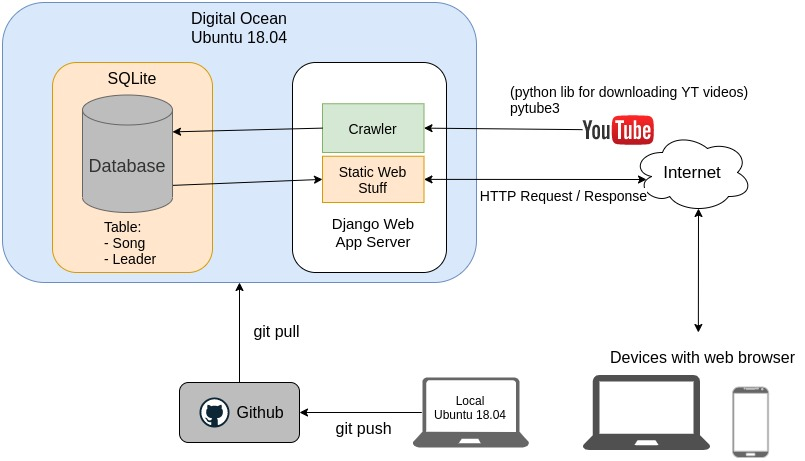

# Guessong
Listen to the music segment and guess the song name as fast as you can!

## Description
"Guessong" stands for "Guess the song". It's a web app game that player can listen to the song and choose the correct song name from four choices. There will be a ten-second countdown for every question, and if the player choose the correct answer, the remaining seconds will be added to the score. Enjoy the game and compete with others on the leaderboard!

Players can also add their favorite songs into the database by easily copy-paste the Youtube link of the song and input the song name.

## Software architecture

## Development Requirements
1. Ubuntu 18.04: development/deployment OS
2. [Pytube3](https://python-pytube.readthedocs.io/en/latest/): Python library for downloading Youtube videos
3. Django 3.1: backend framework (python 3.6.9)
4. HTML / CSS / JavaScript(JQuery): frontend interface
5. SQLite: database
6. DigitalOcean: website hosting in the cloud
7. Git: version control

## How to Play
1. Enter your nickname and play
2. Get the answer as fast as you can

3. Compete with others on the leaderboard
4. You can also add your favorite songs to the database

